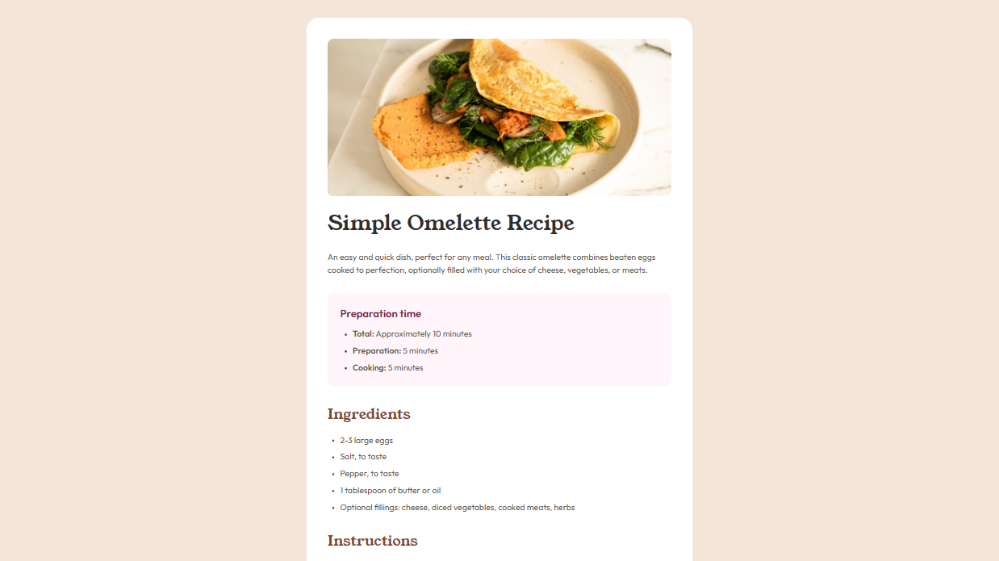

# Frontend Mentor - Recipe page solution

This is a solution to the [Recipe page challenge on Frontend Mentor](https://www.frontendmentor.io/challenges/recipe-page-KiTsR8QQKm). Frontend Mentor challenges help you improve your coding skills by building realistic projects.

## Table of contents

- [Overview](#overview)
  - [Screenshot](#screenshot)
  - [Links](#links)
- [My process](#my-process)
  - [Built with](#built-with)
  - [What I learned](#what-i-learned)
  - [Continued development](#continued-development)
  - [Useful resources](#useful-resources)
  - [AI Collaboration](#ai-collaboration)
- [Author](#author)

## Overview

### Screenshot



### Links

- Solution URL: [https://www.frontendmentor.io/solutions/responsive-recipe-card-using-bem-and-css-variables-7aSgzHtmrt]
- Live Site URL: [https://mrac3k.github.io/frontend-mentor-recipe-component/]

## My process

### Built with

- Semantic HTML5 markup
- CSS custom properties
- Flexbox
- Mobile-first workflow
- BEM methodology

### What I learned

I focused on writing clean, semantic HTML and keeping my CSS organized.

One thing I was proud of was styling the list bullets using the `::marker` pseudo-element instead of adding extra spans or images:

```css
.recipe__timeblock-list li::marker {
  color: var(--rose-800);
  font-size: 0.75rem;
}
```

I also learned the hard way that using `align-items: center` on the `body` breaks scrolling when the card is taller than the screen. I fixed it by switching to `min-height: 100vh` with padding.

Another fix I made was adding the missing Nutrition table. At first I only had a heading and a paragraph, but the design clearly showed a table with data, so I used a proper `<table>` with `<th scope="row">` for better accessibility.

I also used `<strong>` tags inside the instructions list to make the step titles bold, which matched the design better.

### Continued development

I want to keep working on:

- Accessibility (ARIA labels, color contrast, screen reader testing)
- Writing more reusable BEM components
- Better responsive breakpoint strategies

### Useful resources

- [MDN ::marker](https://developer.mozilla.org/en-US/docs/Web/CSS/::marker) - This helped me understand how to style list bullets properly without extra HTML wrappers.
- [BEM 101 by CSS-Tricks](https://css-tricks.com/bem-101/) - A great introduction to the Block Element Modifier methodology. It helped me keep my CSS organized and avoid specificity issues.

### AI Collaboration

I used **Kimi AI** during this project for:

- Code review and catching layout bugs (like the `align-items: center` scroll issue)
- Learning best practices for semantic HTML and BEM naming
- Writing custom `::marker` styles and mobile media queries

What worked well: The AI spotted issues I missed (like the missing `<table>` for the nutrition section and missing `<strong>` tags in the instructions) and explained *why* they were wrong, not just *what* to fix.

What I need to improve: I should try debugging on my own first before asking for help, so I can build better problem-solving instincts.

## Author

- Frontend Mentor - [@Mrac3k](https://www.frontendmentor.io/profile/Mrac3k)
- Telegram - [@Mrackc](https://t.me/Mrackc)
